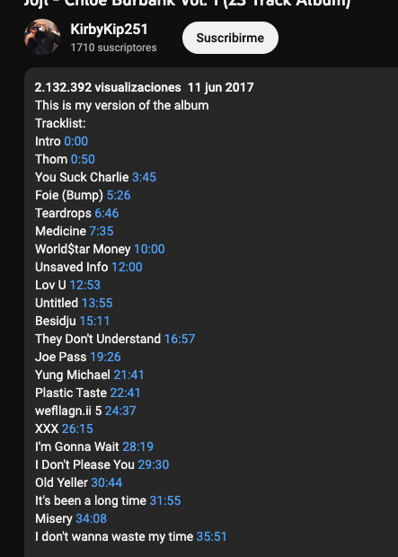

# Youtube song extracter
This is an utility for transforming whole videos of YouTube into different songs. 

## How to use
You need two things:
* List of the songs: the format should be ```song_name XX:XX``` (SONG_PATH)
* File containing the audio file (AUDIO_PATH)

Normally, the list of the songs is available in the comments or in the info section of the video.
Install the requirements and run it:
```shell
python3 main.py -h
usage: main.py [-h] [-a AUDIO_PATH] [-s SONG_PATH] [-c COVER_PATH] [-n ALBUM_NAME] [-r ARTIST_NAME]

optional arguments:
  -h, --help            show this help message and exit
  -a AUDIO_PATH, --audio_path AUDIO_PATH
                        Path to the audio file
  -s SONG_PATH, --song_path SONG_PATH
                        Path to the text file containing the songs and timestamps
  -c COVER_PATH, --cover_path COVER_PATH
                        Path to the cover image
  -n ALBUM_NAME, --album_name ALBUM_NAME
                        Album name
  -r ARTIST_NAME, --artist_name ARTIST_NAME
                        Artist name
```

## Example of usage
Imagine you have obtained [magically](https://github.com/ytdl-org/youtube-dl) Joji's [unreleased album](https://www.youtube.com/watch?v=qOm-trHYlh8&t=1083s). You love to hear Joji's song but you cannot access them in Spotify nor Apple Music. Moreover, you like to hear your music song by song and not in a 38 minute block.

Well, good thing you have come acrroos this app. You look through the comments and you see this.


Good! You can create a .txt file and paste all that inside it. Now, that you have all the information and files:
* Audio file
* Song list
* Name of the artist
* Album name

You can use this little program. First of all, you need to clone the repo, create a virtualenv and install the requirements:
```bash
git clone https://github.com/jaimebw/song_extractor.git
virtualenv venv
source venv/bin/activate
pip -r requirements.txt
```

You put everything in that directory and run:
```bash
python3 main.py -a Joji\ -\ Chloe\ Burbank\ Vol.\ 1\ \(23\ Track\ Album\)-qOm-trHYlh8.m4a -s song_list.txt  -n Chloe\ Burbank\ Vol.1 -r Joji
```
And, tachan! You have Joji's album.
